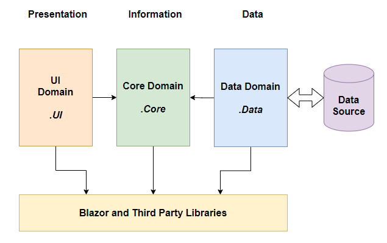
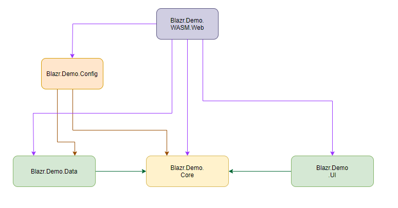
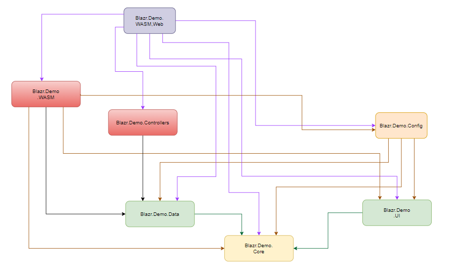

# Blazr Demonstration Template

This template combines the out-of-the-box Blazor Server and Web Assembly templates into a single solution.  The projects are re-organised to:

1. Apply Sound Design principles. 
2. Re-organise the code base so the Blazor Server and WASM SPA's are two implementation of the same code base.
3. Demonstrate component rendering techniques.
4. Demonstrate the Service Notification pattern.

## Sound Design

The basic architecture of the solution splits the application codebase into three domains:

1. **Data Domain** - all code relating to data management.
2. **Core domain** - this is the core application code the business and logical layers of an application.  It has no dependancies on other solution projects.
3. **UI Domain** - this contains all the UI component code.

There are two other support **Domains** for code:

1. **Controller Domain** - the API controller code.  This is strictly not Blazor Code.  It's standard server side DotNetCore.
2. **Config Domain** - contains configuration data for the solution and the Web projects.

Within the project this translates into the following projects:

1. **.Core** - *Microsoft.NET.Sdk* SDK - Contains all the Core Domain code.  No internal project dependancies.
2. **.Data** - *Microsoft.NET.Sdk* SDK - Contains all the Data Domain code.  Only dependancy is on *.Core*.
3. **.UI** - *Microsoft.NET.Sdk.Razor* SDK - contains all the UI component code.  Only Dependancy is on *.Core*.
4. **.Config** - *Microsoft.NET.Sdk.Razor* SDK - contains the application xconfiguration code and the `IServiceCollection` extension methods.   Dependancies are *.Core* and *.Data*.
5. **.Controller** - *Microsoft.NET.Sdk* SDK - contains the API controllers. Normal Dependancy is *.Core*.  Should interface with the data domain through the same interfaces as used by the core.
6. **.Server.Web** - *Microsoft.NET.Sdk.Web* SDK - The Web Server project to run the Server SPA.
7. **.WASM** - *Microsoft.NET.Sdk.BlazorWebAssembly* SDK - the project to build and bundle the WASM codebase.
8. **.WASM.Web** - *Microsoft.NET.Sdk.Web* SDK - The Web Server project to host the WASM SPA and run the WASM API Controllers.
9. **.Tests** - *Microsoft.NET.Sdk* SDK - The XUnit/BUnit test project.

## Project Dependancies

### Server SPA/Web Dependancies

### WASM SPA/Web Dependancies

## Key Design Points:

1. The core application code is separated from the Data Source and UI.  The UI or the Data Source can be changed out without impacting on the application code.
2. The core to data domain interface is through `interfaces`.  This design uses Data Brokers as *thin* pass through layers to implement the interfaces.
3. Using projects for each domain allows good dependancy control.  Namespaces within a project are too easy to breach and more difficult to control and detect.
4. All the Blazor specific code is shared.  It's the same for the WASM and Server SPAs.  The only differencies in this solution are the service configurations for the Data Brokers.

## Running the SPA's

To run the SPA's set the following as the solutiuon startup project:

1. **Server SPA** - **.Server.Web*
2. **WASM SPA** - **.WASM.Web*

## Component Rendering

Review the demo page `Component Rendering` and the coding methods used in it.

## Notification Pattern

Review the `WeatherForecastViewService` and `FetchData` and it's sub-componens `WeatherForecastList` and `WeatherForecastListHeader`.